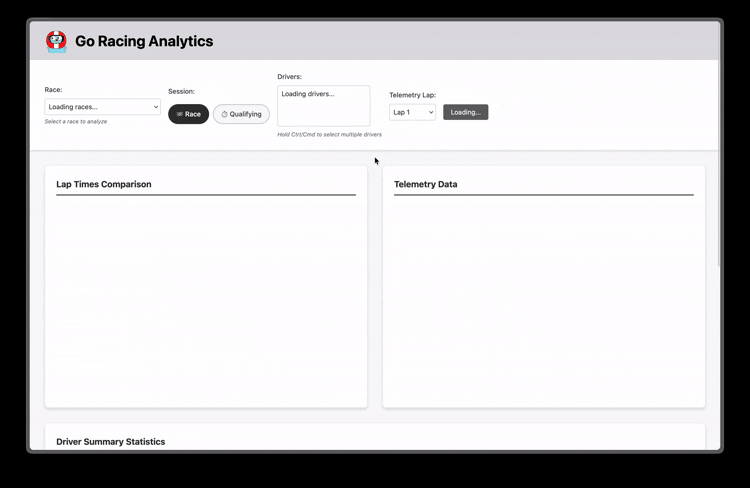

<p align="center">
  
</p>

# Go Racing Analytics

This project is an ETL pipeline and web application dashboard designed to analyze and visualize Formula 1 racing data. It provides insights on overall lap times, lap telemetry, and tire usage. It uses Go for the backend, Python for data ingestion, and TypeScript for the frontend.

It uses the FastF1 package to gather data.

<p align="center">
    
</p>

## Features

- **Overall Lap Times**: View and compare lap times across different drivers
- **Lap Telemetry**: Analyze telemetry data for each lap, both race and qualifying
- **Tire Usage**: Visualize tire usage patterns for each driver
- **Driver Comparison**: Compare performance metrics between drivers

## Development

### Prerequisites

- Node.js (v16 or later) or Bun (v1.2 or later)
- Python (v3.8 or later)
- Go (v1.22 or later)

### Setup

1. Clone the repository:

    ```bash
    git clone https://github.com/jordanjanakievski/go-racing-analytics.git
    ```

2. Navigate to the project directory:
    ```bash
    cd go-racing-analytics
    ```
3. Install frontend dependencies:
    ```bash
    cd frontend
    bun install
    ```
4. Install backend dependencies:
    ```bash
    cd backend
    go mod tidy
    ```
5. Set Up Data Ingestion

    ```bash
    python setup.py
    ```

6. Start the backend server:

    ```bash
    go run main.go
    ```

7. Start the frontend development server:

    ```bash
    cd frontend
    bun dev
    ```

8. Open your browser and navigate to `http://localhost:3000` to view the application.

### Docker Setup

1. Run the docker compose command to build and start the application:

    ```bash
    docker compose up --build
    ```

## Adding New Data

To add new data to the application, follow these steps:

```bash
python fetch_and_populate.py --year XXXX --event LOCATION --session R
python fetch_and_populate.py --year XXXX --event LOCATION --session Q
```

Familiarize yourself with [FastF1](https://docs.fastf1.dev/) for details on how to specify the year and event.
